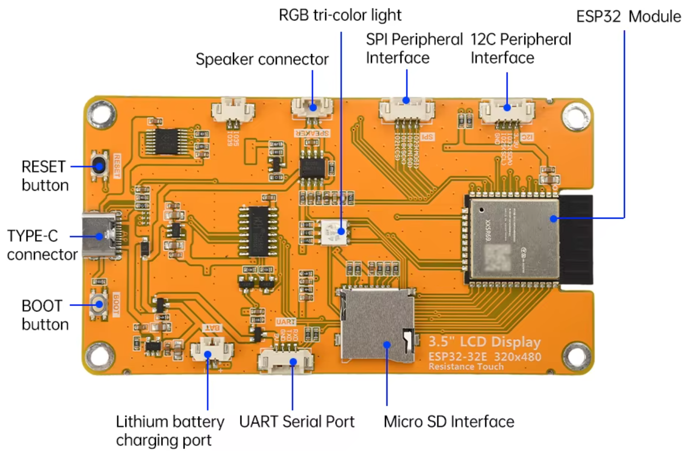
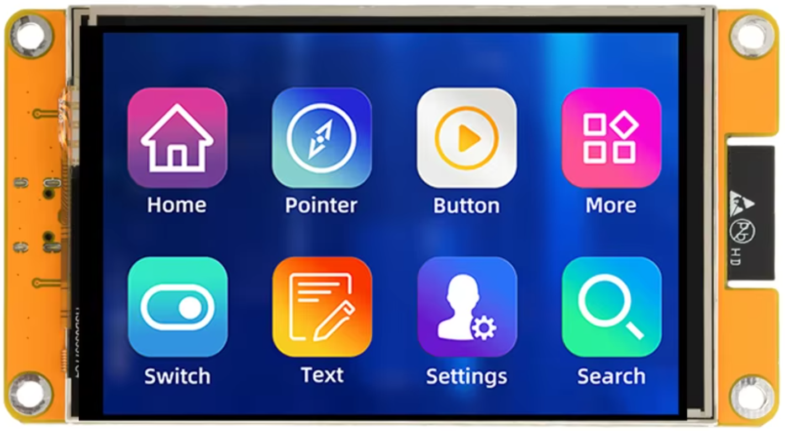
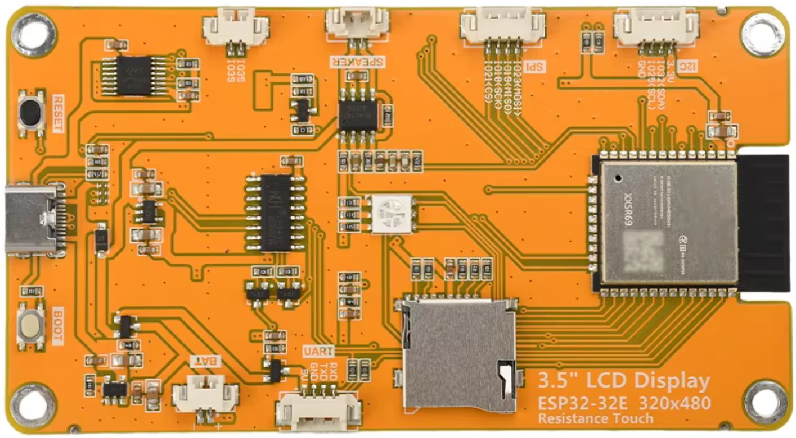

# CYD
pinout and configfiles for som CYD clones

Working LovyanGFX configuration for the AliExpress: **DIYTZT ESP32 LVGL WIFI & Bluetooth Development Board 2.4 inch LCD**
Board label:"**ESP32-24**"
LCD marking: "**LI435S-2.4**"
Controller:ILI9342 Touch controller:XPT2046 IPS resistive touch

Working LovyanGFX configuration for the AliExpress **ESP32-2432S028(R) 2.8" ST7789(ST7796)**
Board label:"**ESP32-2432S028**"
LCD marking: "**TPM408-2.8**"
Controller:ST7789(ST7796) Touch controller:XPT2046 resistive touch Library tested:LovyanGFX 1.2.26

Working LovyanGFX configuration for the AliExpress:
**"3.5 inch LCD Display ESP32-32E 320x480 Resistance Touch"**
Board label: **3.5" LCD Display ESP32-32E 320x480 resistance touch**
LCD marking: **HSD035577F4**
Controller:ST7796 Touch controller:XPT2046 resistive touch Library tested:LovyanGFX 1.2.26

All in separate directories.  

**"3.5 inch LCD Display ESP32-32E 320x480 Resistance Touch"**

## Why this repository exists
This display is sold without a proper datasheet or pinout documentation.

The manufacturer specifies:
- LCD size: 3.5 inch
- Resolution: 320 x RGB x 480
- Controller: ST7796U
- Interface: 4-wire SPI

However, finding a working LovyanGFX configuration requires some reverse engineering.

This repository contains the working configuration for the board received 
on july2026 from diymore Direct Store on AliExpress sold as 
"3.5 inch ESP32 LCD TFT touchscreen display module 2.8" ESP-32 WIFI Bluetooth" and 3 board pictures.

#########################
# Working configuration #
#########################

## TFT
Controller:ST7796
SPI:
| Signal | ESP32 GPIO |
|---|---:|
| SCLK | 14 |
| MOSI | 13 |
| MISO | 12 |
| CS | 15 |
| DC | 2 |
| RESET | not connected |
| Backlight | 27 |

LovyanGFX:lgfx::Panel_ST7796  _panel;

Settings:
spi_mode    = 0
rgb_order   = false
invert      = false
rotation    = 3 
Display orientation: 480 x 320 landscape
USB-C connector on the left

## TOUCH
Controller: XPT2046
Shared SPI bus with TFT.

Signal	ESP32 GPIO
SCLK	  14
MOSI	  13
MISO	  12
CS	    33
INT	    36

Settings:
offset_rotation = 6
Calibration:
x_min = 280 //may result in negative values up to 65508
x_max = 3860
y_min = 340
y_max = 3860

## SD card
SD uses a separate SPI bus.
Bus:HSPI

SCLK	18
MISO	19
MOSI	23
CS    5

------------------------------------
------ Complete pin summary --------
------------------------------------

ESP32-32E 3.5"

TFT ST7796
------------
CS       15
DC        2
BL       27
SCLK     14
MOSI     13
MISO     12

Touch XPT2046
-------------
CS       33
INT      36
SCLK     14
MOSI     13
MISO     12

SD
-------------
CS        5
SCLK     18
MOSI     23
MISO     19

----

Detection notes
The TFT controller was verified by reading SPI registers.
Only: CS = 15 returned valid controller responses.

===== CS = 15 =====
Reg 09 : 00 71 80 00
Reg 0A : 18 00 00 00
Reg D3 : 00 7F DF 00

Other tested CS pins returned only 00 00 00 00

Problems solved
Black screen
Cause: Wrong TFT initialization.
Solution:
Use:

Panel_ST7796
with:
CS = 15
DC = 2

Wrong colors

Cause:

RGB order.

Solution:

rgb_order = false;
Touch rotated incorrectly

Cause:

Touch controller orientation differs from TFT orientation.

Solution:

offset_rotation = 6;
Tested hardware

Board label:

3.5" LCD Display ESP32-32E
320x480 resistance touch

LCD marking:

HSD035577F4

<b>Credits</b>
me & ChatGPT

Configuration discovered by testing:
- SPI register reads
- ST7796 initialization
- LovyanGFX configuration
- XPT2046 orientation calibration

